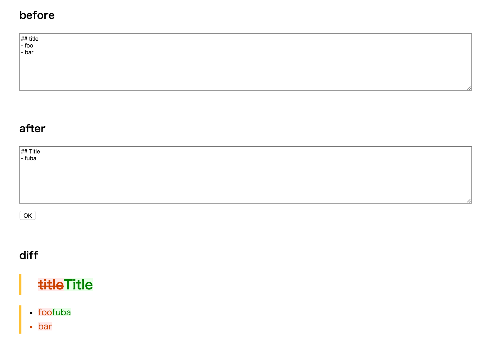

# Markdiff

[](https://github.com/r7kamura/markdiff/actions/workflows/test.yml)

Rendered Markdown differ.

## Usage
```rb
require "markdiff"

differ = Markdiff::Differ.new
node = differ.render("<p>a</p>", "<p>b</p>")
node.to_html #=> '<div class="changed"><p><del>a</del><ins>b</ins></p></div>'
```

See [spec/markdiff/differ_spec.rb](spec/markdiff/differ_spec.rb) for more examples.

### Demo
Execute `ruby example/app.rb` to run [demo app](example/app.rb).


